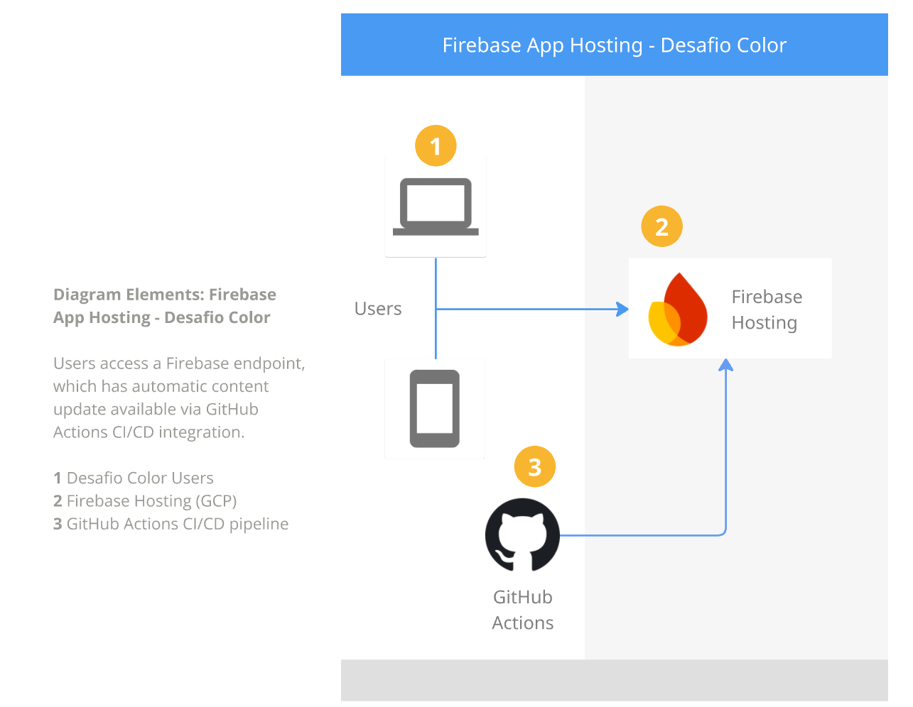

# 🖨️ Desafio Color Landing Page

A modern, responsive landing page for a stationery and printing business. This project showcases services such as printing, toner refills, key copying, and mobile repair using a clean, colorful interface.

Built with **React**, **TypeScript**, and **Tailwind CSS**, and deployed automatically via **Firebase Hosting**.

## 🚀 Technologies Used

* **[React](https://react.dev/)**: Frontend library for building the user interface.
* **[TypeScript](https://www.typescriptlang.org/)**: For type-safe code and better developer experience.
* **[Tailwind CSS](https://tailwindcss.com/)**: Utility-first CSS framework for rapid styling.
* **[Firebase Hosting](https://firebase.google.com/products/hosting)**: Fast and secure static hosting.

## 🎨 Features

* **Responsive Grid Layout**: Services are displayed in a grid that adapts from mobile (1 column) to desktop (4 columns).
* **Interactive UI**: Hover effects, fade-in animations, and "rainbow" color themes for different service categories.
* **Asset Optimization**: Images served directly from the public directory for optimal performance.

---

## 🛠️ Getting Started

### Prerequisites
Make sure you have **Node.js** installed on your machine.

### Installation

1.  Clone the repository:
    ```bash
    git clone https://github.com/gfariasilva/desafio-color-landing-page.git
    cd desafio-color-landing-page
    ```

2.  Install dependencies:
    ```bash
    npm install
    ```

3.  Start the development server:
    ```bash
    npm run dev
    ```

---

## 🔥 Firebase Integration & Deployment

This project uses **Firebase Hosting** for deployment. The configuration is handled via `firebase.json`.

### 1. Build Configuration
The project is configured to deploy the production build.
* **Source Code**: `/src`
* **Public Assets**: `/public`
* **Output Folder**: `/dist` 

### 2. Manual Deployment
To deploy the site manually from your terminal:

1.  Create the production build:
    ```bash
    npm run build
    ```
2.  Deploy to Firebase:
    ```bash
    firebase deploy
    ```

### 3. CI/CD (GitHub Actions)
Automatic deployment is set up. Pushing to the `main` branch will trigger a workflow that builds the app and deploys it to Firebase Hosting automatically.

---

## 📂 Project Structure

```text
├── public/              # Static assets (images, etc.)
├── src/
│   ├── components/      # React components (ui/card, etc.)
│   ├── assets/          # Importable assets (svgs, small icons)
│   ├── App.tsx          # Main application entry
│   └── main.tsx         # DOM rendering
├── firebase.json        # Firebase hosting configuration
├── tailwind.config.js   # Tailwind customization
└── package.json         # Dependencies and scripts
```

### 4. Architecture Diagram
